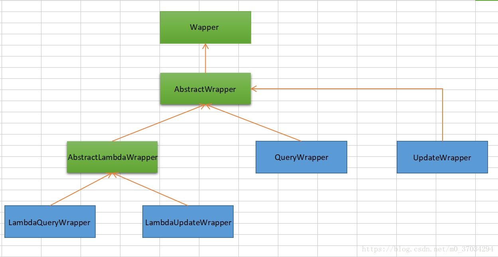

# MybatisPlus条件构造器

>本文转自 https://blog.csdn.net/bird_tp/article/details/105587582

>首先奉上mybatis plus的官方文档链接，再看本博客有不清晰的地方，可以查看文档 https://baomidou.com/

## 一、queryWrapper是什么
>queryWrapper是mybatis plus中实现查询的对象封装操作类，他的层级关系如下



> 在上面的图片中
> Wrapper ： 条件构造抽象类，最顶端父类，抽象类中提供4个方法西面贴源码展示
> AbstractWrapper ： 用于查询条件封装，生成 sql 的 where 条件
> AbstractLambdaWrapper ： Lambda 语法使用 Wrapper统一处理解析 lambda 获取 column。
> LambdaQueryWrapper ：看名称也能明白就是用于Lambda语法使用的查询Wrapper
> LambdaUpdateWrapper ： Lambda 更新封装Wrapper
> QueryWrapper ： Entity 对象封装操作类，不是用lambda语法
> UpdateWrapper ： Update 条件封装，用于Entity对象更新操作

## 二、使用demo

```
使用的关键的代码
QueryWrapper<PbListBlack> sectionQueryWrapper = new QueryWrapper<>();
sectionQueryWrapper.eq("OPTYPE", 1);
sectionQueryWrapper.eq("BLTYPE", 1);
List<PbListBlack> pbListBlacks = iPbListBlackMapper.selectList(sectionQueryWrapper);
上面这段代码的意思就是，首先新建一个QueryWrapper对象，类型为PbListBlack对象，也就是你需要查询的实体数据
```

```
sectionQueryWrapper.eq("OPTYPE", 1);
sectionQueryWrapper.eq("BLTYPE", 1);
这两句的意思是PbListBlack对象对应的数据库表中的OPTYPE，BLTYPE字段值要为1，然后调用iPbListBlackMapper.selectList方法，入参就为前面新建好的查询对象封装类
```
>下面贴上查询实体的代码
```java
@Data
@EqualsAndHashCode(callSuper = false)
@Accessors(chain = true)
@TableName("PB_LIST_BLACK")
@ApiModel(value = "PB_LIST_BLACK对象", description = "")
public class PbListBlack extends Model<PbListBlack> {
   @TableField("ID")
   private Long id;
   
   @TableField("USERID")
   private String userId;
   
   @TableField("SPGATE")
   private String spgate;
   
   @TableField("SPNUMBER")
   private String spnumber;
   
   @TableField("PHONE")
   private Long phone;
   
   @TableField("OPTYPE")
   private Integer optype;
   
   @TableField("OPTTIME")
   private Timestamp optTime;
   
   @TableField("CORPCODE")
   private String corpCode;
   
   @TableField("SVRTYPE")
   private String svrType;
   
   @TableField("MSG")
   private String msg = " ";
   
   @ApiModelProperty(value = "黑名单类型。1：短信；2：彩信")
   @TableField("BLTYPE")
   private Integer blType;
}
```

>然后是iPbListBlackMapper的代码，代码很简单
```
@Repository
public interface IPbListBlackMapper extends BaseMapper<PbListBlack> {
}
仅仅只需要基层BaseMapper接口即可，这样mybatis plus底层封装的方法即可实现帮你查询你设置查询条件查询到的数据
当你的Mapper 继承BaseMapper接口后，无需编写 mapper.xml 文件，即可获得CRUD功能
```

## 三、QueryWrapper的方法


## 四、总结
&emsp;&emsp;上面的博客内容虽然简单，也只展示了一个查询的功能。在你实际使用的时候，可以按照  条件构造器上面包含的的方法，设置你查询数据的条件，调用BaseMapper里相应的方法即可